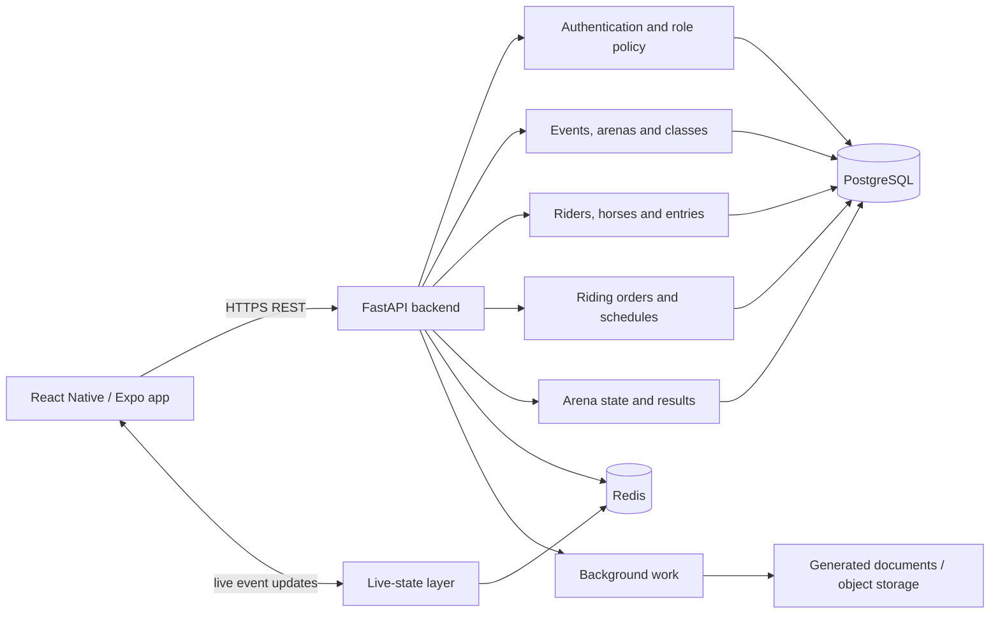

# Showtime — Equestrian Event Management

Showtime is a mobile-first equestrian event-management platform designed for South African shows. It connects organisers, riders, stewards, judges and spectators around one live view of the show day—from event setup and entries to riding orders, arena operations and results.

[Visit the product website](https://showtimehorses.co.za) · [Download Show Time ZA on the App Store](https://apps.apple.com/za/app/show-time-za/id6780048003) · [View the developer's GitHub profile](https://github.com/James-Gooch-Git)

> **Released and actively evolving:** Show Time ZA is available on the South African Apple App Store. Android distribution and several wider commercial workflows remain planned rather than shipped.

## Portfolio context

I am Showtime's 50/50 co-founder and sole software developer. I designed and implemented the mobile application, backend services, domain model, show-day workflows, testing and release pipeline, and took the iOS product through App Store submission.

This repository is a documentation-only portfolio showcase. The commercial source code, signing credentials, operational configuration and user data remain private.

## The problem

Many shows still coordinate entries, riding orders, arena progress and results through spreadsheets, paper, messaging groups and repeated announcements. The information becomes stale quickly: riders do not know when they are due, gate staff field the same questions, organisers manually reconcile changes and results are delayed.

Showtime is designed around a shared event state:

1. An organiser creates an event, arenas and classes.
2. Riders manage horses and enter available classes.
3. The organiser publishes riding orders and show-day access codes.
4. Stewards or judges operate an arena through a focused mobile workflow.
5. Riders and spectators follow the live board and results.
6. Organisers keep event progress and changes in one system.

## Available in the current iOS release

The App Store release currently supports:

- email-and-password accounts;
- organiser event, arena and class setup;
- schedule or riding-order document import;
- published riding orders;
- organiser-issued steward and spectator access codes;
- rider profiles and horse management;
- rider class entries and organiser-issued riding-code claims;
- live show-day arena boards;
- event updates and progress tracking;
- results review;
- expanded organiser setup and shared rider/organiser profiles;
- PDF setup import with a manual fallback when a document cannot be interpreted reliably.

The App Store listing explicitly distinguishes planned work: paid spectator passes, trainer-submitted entries, social sign-in, and payment/refund flows are not part of the current release.

## Product design

### Organisers

- Create events, arenas and classes.
- Import or build event schedules and riding orders.
- Publish show-day information and event updates.
- Issue scoped access codes to temporary operators and spectators.
- Monitor class progress, entries and results.

### Riders, trainers and parents

- Maintain rider and horse profiles.
- Browse available events and classes.
- Enter classes and claim organiser-issued riding codes.
- View riding orders and live arena state.
- Review results after a round or class.

### Stewards and judges

- Join an event with an organiser-issued code.
- Use a focused show-day interface rather than the full organiser dashboard.
- Advance an arena and record the information required by the active workflow.
- Work with controls designed for quick use on a phone at the ring.

### Spectators

- Use event-scoped guest access for read-only live boards and results.
- Follow the current and upcoming riders without requiring organiser privileges.

## Architecture



The backend follows a route → service → repository → ORM structure. The mobile client uses server state and local caching to present role-specific workflows while keeping permissions and event ownership checks on the backend.

## Domain model

```text
Organisation
└── Event
    ├── Arenas and live arena state
    ├── Classes
    │   ├── Rider/horse entries
    │   ├── Riding orders
    │   └── round results and penalties
    ├── Day schedule
    └── Event-level entries and access codes

User
├── Roles and event permissions
├── Rider profile
├── Horse profiles
└── Notifications
```

The model treats a class entry as a rider-and-horse combination, which is important when one rider competes on multiple horses or the same horse appears in more than one class.

## Technical stack

- React Native and Expo with Expo Router
- TypeScript
- FastAPI and Python 3.12
- PostgreSQL with SQLAlchemy and Alembic
- Redis for live state, caching and session-related workflows
- React Query, Zustand and Axios in the mobile client
- Secure device storage for authentication state
- Expo notifications and EAS build/release tooling
- Jest and React Native Testing Library
- Pytest, Ruff, mypy and backend coverage checks
- iOS App Store distribution

Some private architectural documents describe later-phase web, payment, background-task and object-storage capabilities. They are not presented here as part of the current App Store release unless stated above.

## Engineering considerations

### Show-day state changes quickly

A riding order can change because of scratches, substitutions or arena delays. The system needs a clear authoritative event state while still updating mobile clients promptly.

### Temporary operators need constrained access

Volunteer stewards may only need access for one event or arena. Event-scoped codes reduce setup friction while limiting the scope of the operator session.

### Equestrian scheduling has domain constraints

Riding-order and schedule logic must account for rider/horse combinations, horses entered more than once, arena sequencing and sufficient recovery time. Automation needs visible fallback and organiser override paths.

### Rural connectivity cannot be assumed

South African showgrounds can have intermittent connectivity. The product direction includes lightweight payloads, cached show information and recovery from dropped live connections. Offline tolerance continues to evolve and is not described as fully offline operation.

### One person may hold several roles

A user may be both a rider and organiser. The application supports shared account context while backend policy still evaluates permissions for the current event and action.

## Quality and release engineering

The private codebase includes:

- mobile Jest and React Native Testing Library tests;
- backend Pytest coverage;
- strict mypy configuration;
- Ruff linting with security-oriented rules;
- TypeScript type checking and ESLint;
- separate development, integration, QA and release branches;
- Expo EAS and App Store release workflows.

No test count, coverage percentage or security guarantee is claimed here because those values change with the active release.

## Security and privacy

- Commercial source, credentials, signing assets and operational data are excluded from this repository.
- Sensitive permissions and event ownership are evaluated by the backend, not trusted to the mobile client.
- Steward and spectator codes are scoped to event workflows rather than granting general account privileges.
- Rider, horse and event information requires appropriate access and retention controls.
- Under-18 participant information requires particular privacy and consent consideration.
- The product has not been described as independently security-certified or penetration-tested.

See the live product's [privacy policy](https://james-gooch-git.github.io/showtime-privacy/) for the current user-facing policy.

## Screenshots and demonstration

Screenshots will be added using demonstration events and synthetic participants.

| Planned screenshot | Intended focus |
| --- | --- |
| Event discovery | Rider-facing event and class browsing |
| Organiser setup | Events, arenas and classes |
| Riding order | Published rider/horse ordering |
| Live arena board | Current competitor, next competitor and progress |
| Steward workflow | Focused show-day controls |
| Results | Completed rounds and class placings |

The live marketing site contains a product walkthrough and a demo-request form: [showtimehorses.co.za](https://showtimehorses.co.za).

## Current limitations and roadmap

- Android is advertised as coming soon and is not claimed as a released store build.
- Payments and refunds are not part of the current App Store release.
- Trainer-submitted entries and social sign-in remain planned.
- Offline tolerance and cross-device live-state recovery continue to be hardened.
- Additional discipline-specific scoring and workflows will be introduced incrementally.
- Privacy-safe screenshots and video walkthroughs will be added to this showcase.

## Repository scope and ownership

This repository intentionally contains documentation only. It does not grant access to the private commercial implementation or permission to reproduce it. No open-source licence is currently offered.

For a product walkthrough or professional enquiry, contact [jamesworkgooch@gmail.com](mailto:jamesworkgooch@gmail.com).
